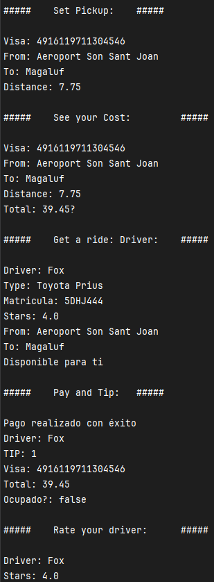

Basado en [Cotxox de dfleta](https://github.com/dfleta/cotxox). El programa simula los hipotéticos cálculos que una empresa de transporte podría realizar a la hora de poner valor a los servicios de sus conductores, así como características de valoración para susodichos conductores similares a aquellas que pueden encontrarse en Uber o BlaBlacar. Muestra sus resultados por consola.

